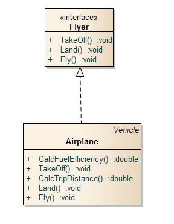
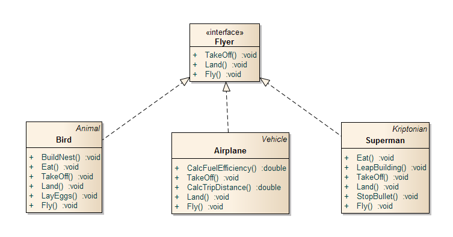
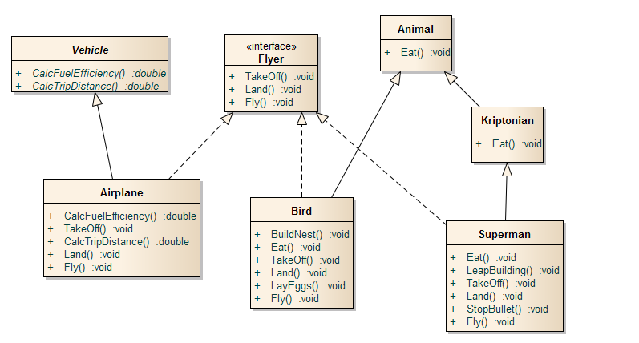
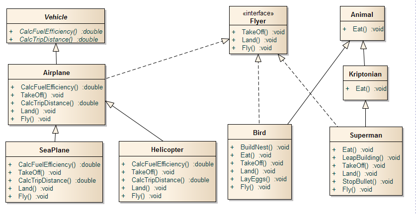

cd # Understanding Interfaces with C#

    The public interface of a class is a contract between the client code and the class that provides the service. Concrete classes implement each method. However, an abstract class can defer the implementation by declaring the method to be abstract, and a C# interface declares only the contract and no implementation.
    

    

    A concrete class implements an interface by defining all methods declared by the interface. Many classes can implement the same interface. These classes do not need to share the same class hierarchy. Also, a class can implements more than one interface.
    

    

    Imagine a group of objects that all share the same ability: they fly. You can construct a public interface, called <i>Flyer</i>, that supports three operations: <i>TakeOff</i>, <i>Land</i> and <i>Fly</i>.
    

    
<b>Fig 1. The interface flyer and airplane class diagram</b>
 
    

    
    
 
    

    There can be multiple classes that implement the Flyer interface, as shown of the next figure
    

    
<b>Fig 2. Multiple implementations of the Flyer interface.</b>
 
    

    
    
 
    

    This sounds like multiple inheritance, but it is not quite that. The danger of multiple inheritance is that a class could inherit two distinct implementation of the same method.
    

    
<b>Fig 3. A mixture of inheritance and implementation.</b>
 
    

    
    

    

    An Airplane is a Vehicle, and it can fly. A bird is an Animal, and it can fly. These examples show that a class can inherit from one class but also implement some other interface.
    

    

    This sounds like multiple inheritance, but it is not quite that. The confusion of multiple inheritance is that a class could inherit two distinct implementations of the same method. This is not possible with interfaces because an interface method declaration does not supply implementation.
    Suppose that you are constructing an aircraft control software system. The following diagram shows its class hierarchy
    

    
<b>Fig 4. A mixture of inheritance and implementation.</b>
 
    

    
    
 
    

    The airport must grant permission to land and take off for flying objects of all types, then the code for the airport could look like the following.
    

    
<b>Running the sample</b>
 
    

    
    

